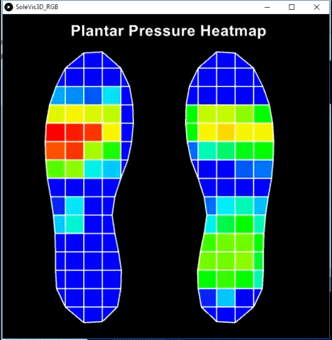

# Data Acquisition

## User Interface

- A User Interface (UI) is built on Java Script to make it independent of platform e.g. Windows, Android, IOS etc. This UI is browser compatible and can be deployed on any of the modern computing devices like smartphones, laptops and PC’s.

- This UI is browser compatible and can be deployed on any of the modern computing devices like smartphones, laptops and PC’s.

The data acquisition process consists of four steps; 
- The subject’s information such as age, weight and height which have to be entered in the respective fields. The transcribed details are then used for further detailed analysis.

- A 20 seconds count down timer starts as soon as the user clicks the start button after giving his details. This timer allows the user to prepare himself for the experiment. 

- The user starts performing the activity as soon as the instructions appear on the screen and a timer starts ticking recording the elapsed time of the activity performed. 

The block diagram below depicts wireless data acquisition through TCP/IP protocol

**The code will for the UI will be uploaded soon**

## Data Visualization

- Data collected from individuals was visualized using Processing Environment. You can read more about processing here https://processing.org/

- The pressure distributions are unique to each individual and vary based on several factors such as body weight, age and
foot shape. Therefore, the plantar surface of the foot was divided into multiple regions and visualized.

- 3D visualizations can be seen below

- Shown below is the 3D visualization of plantar pressure captured in real time

