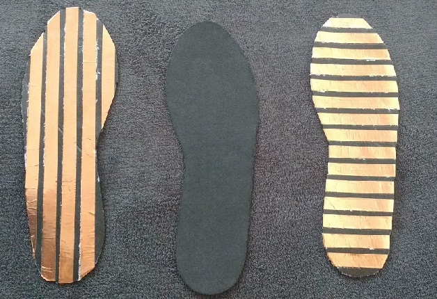
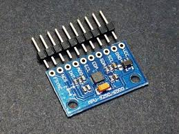
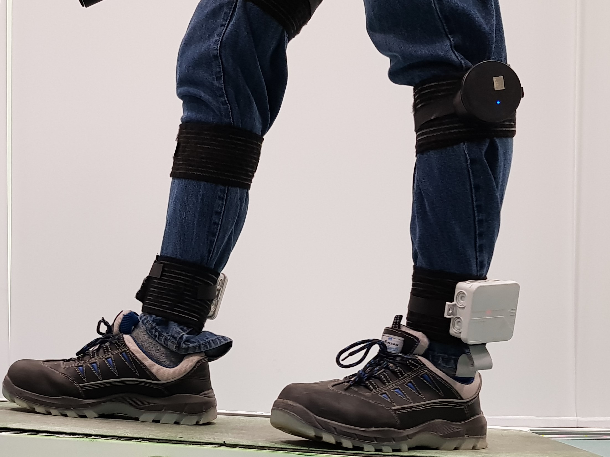

## Hardware system overview

The backbone of the developed gait analysis system is the hardware system and a low-level user interface written in java script for data acquisition. The Hardware system includes 

- A Plantar Pressure measuring Insole

- Inertial measurement units to measure the segment orientations of the lower limbs

## Plantar Pressure Insole

- Emphasis was given in designing piezo-resistive based sensorized insoles. A detailed integrated research on the choice of piezo-resistive
materials was carried out prior to this research

- The assembly and wiring of the insole are show below, here copper electrodes are used which facilitate a matrix structure and the voltage is measured across each node as the resistance in the piezo material changes through a conditional circuit.

- The insoles are inserted into a shoe of size EU 43 and the wiring circuit is fabricated as shown below, the complete sensor setup on the subject is shown below

## Inertial measurement Units

- A Motion Processing Unit (MPU) developed by InvenSense was used in this project as IMU’s. This is the smallest 9- axis MPU that combines 3D accelerometers, 3D gyroscope and 3D magnetometer.

## Sensor Setup on the Subject

- After calibration and fabrication of the sensors into enclosures the complete setup looks as below

