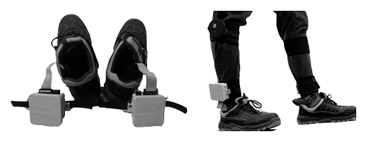
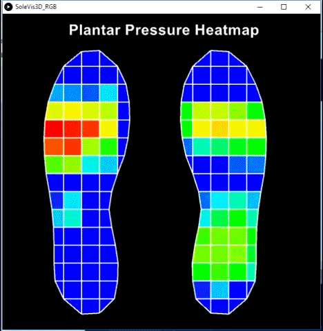

# Deep-Learning-based-Gait-Abnormality-Detection

Design & Development of a Wearable Sensor Platform used for quantitative analysis using Deep Learning for detecting abnormal characteristics associated with human gait.  

In this research a wearable sensor system is presented, which combines **Plantar pressure measurement unit** and **Inertial Measurement Units (IMU’s)** integrated with a stacked Long short-term memory (LSTM) model to detect human gait abnormalities that are prone to the risk of fall.

The repository is structured as follows:
## - [Introduction](Introduction)

Provides a clear insight into the fundamentals of gait and the characteristics associated with Normal and Abnormal gait behaviors.

## - [Hardware development](Hardware_development)

Showcases the sensor system hardware and software that was designed and developed suitable for the current goal

## - Data Visualization

### Visualization of data vollected from the developed sensor system

As pressure distributions are unique to each individual and vary based on several factors such as body weight, age and foot shape visualizing the quantitative data collected from the insole will help further for indepth analysis

## - [Abnormal Gait Detection using Deep Learning](src)

 - Abnormal gait data acquisition through simulation of three specific abnormal gait activity
 
 - Using a stacked LSTM model trained on normal behaviour to compute the error vectors for each of sequences, This error vector is then    used as a metric value for detecting abnormality
- Conclusion
