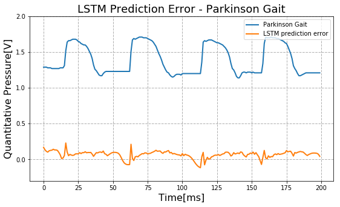

## Gait Analysis using Long Short Term Memory Networks

- Abnormal gait is characterized as a behavior that deviates from normal gait due to different kinds of abnormalities / disorders. Abnormal gait is devoid of many significant gait functions like sensation, strength, coordination which are observed in a healthy(normal)
gait.

- a methodology to detect abnormal gait by utilizing the
characteristics of normal gait data analyzed

- Natural gait data from first group containing 7 participants was collected, the procedure
of the experiment was first explained to the participants and two inertial sensors are
attached on the thigh and shank on both limbs, the pressure sensing insole was placed
into respective foot wear

- Second group of participants were asked to simulate three specific gait abnormalities
involving spastic gait, parkinson’s gait and sensory ataxic gait

- A stacked Long Short-Term Memory (LSTM) Network is
trained using the dataset of the first group to predict the next
subsequent sample in the time series

- The prediction model learns to predict l values; here
l=1 for N of the input variables. The training sequences
(normal data) are divided into three sets: normal train (tn),
normal validate (nv) and normal test (nt). The abnormal data is
also segmented into abnormal validate (av) and abnormal test
(at).

## Training progress

## LSTM Error Predictions on Healthy Gait

## LSTM Error Predictions on Simulated Abnormal Gaits

Gait Simulation      |LSTM output       
---      |---------|
    | 
    | 

## Summary
The proposed stacked LSTM recurrent neural network demonstrates how abnormal gait behavior can be detected considering the characteristics of the error predictions, For normal gait the LSTM error predictions are in the order of 0.02 but for the simulated abnormal gaits error predictions vary from 0.20 to 0.25, The abnormalities have different levels of difficulty as far
as detection is concerned. Error characteristics are also subjective and vary from each type of abnormality. Also, to validate the model output and to differentiate gait characteristics significant gait parameters were calculated that show contrasting difference between normal and abnormal behaviors.

### Refer [here](../Introduction/Thesis.pdf) for more information
